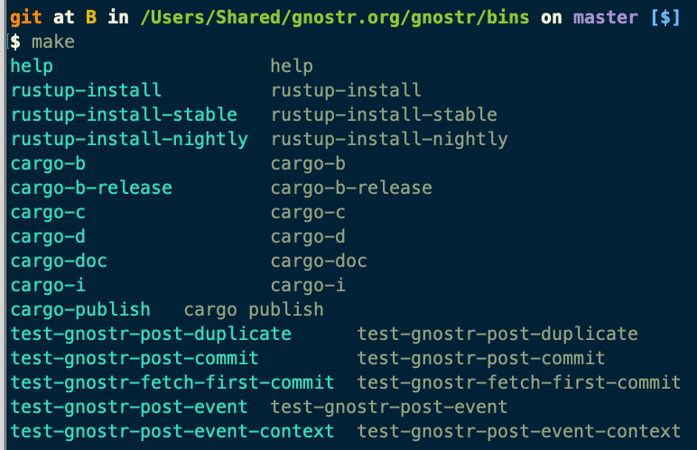

## gnostr-bins

### Some command-line tools for nostr.

##### make



#### Usage:
#### In context of other gnostr utilites

```
gnostr --sec $(gnostr-sha256 $(gnostr-weeble)) \
-t gnostr \
--tag weeble $(gnostr-weeble) \
--tag wobble $(gnostr-wobble) \
--tag blockheight $(gnostr-blockheight) \
--content 'gnostr/$(gnostr-weeble)/$(gnostr-blockheight)/$(shell gnostr-wobble))' \
| gnostr-post-event --relay wss://nos.lol
```
